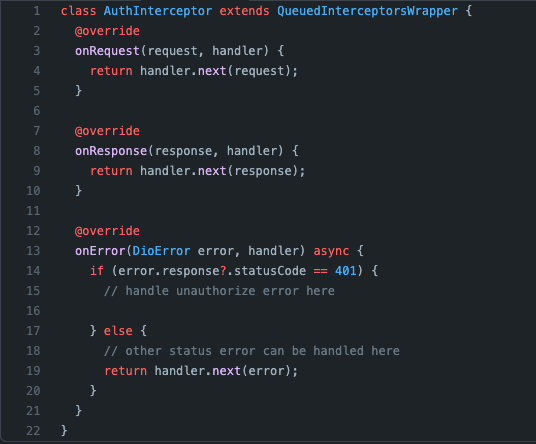
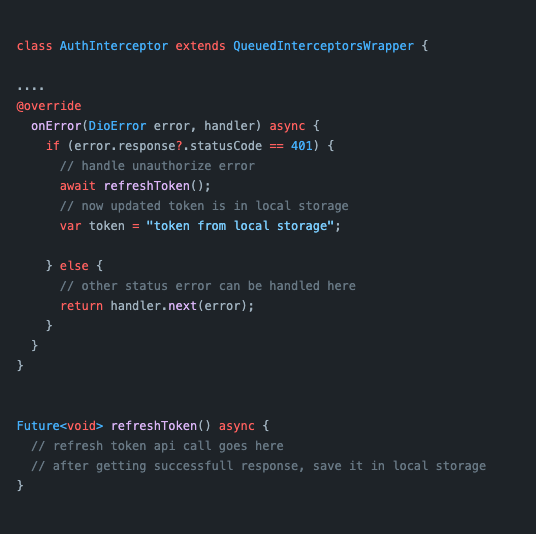
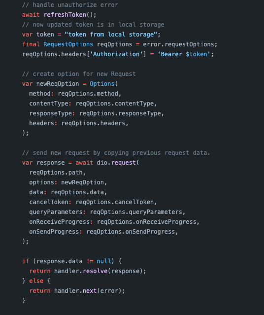
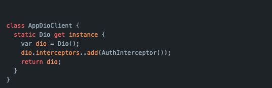

# Handling 401 UnAuth exception with Dio Client

Dio is one of my favourite http library, 

Here I'm share how to handle 401 UnAuthorized error with Dio.

## Here are the steps to configure Auth interceptor

1. Create ``AuthInterceptor`` class by extending ``QueuedInterceptorsWrapper``
2. Write refresh token logic in ``onError`` function
3. Create new request by copying existing request data.
4. Add AuthInterceptor class in ``Dio`` instance

lets see in detail

1. Create ``AuthInterceptor`` class by extending QueuedInterceptorsWrapper and override below method as shown in image.

    1. onRequest
    2. onResponse
    3. onError

    

2. We are gonna write our logic in onError method,
    
    First Call ``RefreshToken`` api and store new token in your local storage as below

    

3. Now create new Request by copying original request data. 
And don't forget to add token from your local storage as shown in the image

    

4. Now you are ready with ``AuthInterceptor`` add this inteceptor into your ``dio`` instance, 
This is my way of creating Dio instance

    