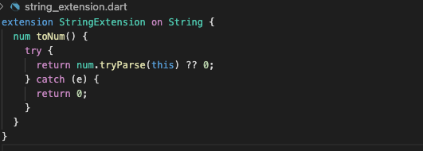

# Extension functions are life saver

I always get num values in String format from my backend team, they never fixed this issue.

Then i create String extension in my utility dir to hold all my string dependent funcion 

Here is one of them
[Click here for source code](../source/string_extension.dart)

